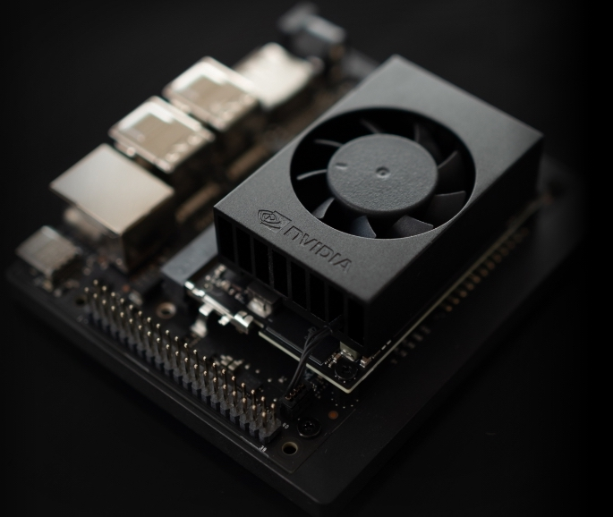
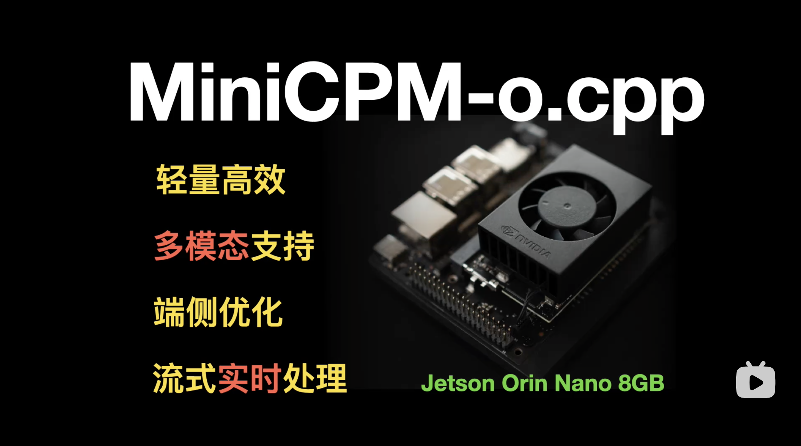

# 安装部署
下面我们逐步骤进行项目的编译及模型部署。

## 一、模型转换

### 1. 使用已转换并量化的gguf模型（推荐）
下载链接：[Google Drive](https://drive.google.com/drive/folders/1xmkPHCzClJolUsEG_J6HZCATurjo3mDt?usp=sharing)

### 2. 手动进行模型的转换和量化（可选）
即将release...

## 二、模型推理
### 1. python调用示例 (推荐)
为了方便项目集成，我们使用了python binding。
安装：
```bash
pip install uv # 推荐使用uv进行python环境和包管理

uv venv # 创建虚拟环境
source .venv/bin/activate # 激活虚拟环境
# source .venv/bin/activate.fish  # for fish shell

uv pip install -e . --verbose # 本地安装
```

启动脚本：
```bash
# in project root path
python test/test_minicpmo.py --apm-path models/minicpmo-audio-encoder_Q4_K.gguf --vpm-path models/minicpmo-image-encoder_Q4_1.gguf --llm-path models/Model-7.6B-Q4_K_M.gguf --video-path assets/Skiing.mp4
```

### 2. C++ 调用示例 (可选)
为了方便项目集成，开放了C++接口，我们使用了ffmpeg作为输入视频的编解码工具。
#### 2.1 FFmpeg视频编解码工具安装
ffmpeg工具安装见 [ubuntu安装步骤](../examples/minicpmo/README.md#video) 或 [FFmpegg官网](https://ffmpeg.org/download.html).

#### 2.2 CMake构建选项
在cmake中打开examples的构建选项：
```bash
cmake --preset ggml-cuda -DBUILD_EXAMPLES=ON
cmake --build build
```

#### 2.3 CLI运行示例
编译完成后，可使用以下启命令：
```bash
# in project root path
./build/bin/minicpmo-cli assets/Skiing.mp4 models/minicpmo-image-encoder_Q4_1.gguf models/minicpmo-audio-encoder_Q4_K.gguf models/Model-7.6B-Q4_K_M.gguf
```

## 三、WebUI Demo
实时视频交互demo：

1. 启动 model server
```shell
# in project root path
uv pip install -r web_demos/minicpm-o_2.6/requirements.txt
python web_demos/minicpm-o_2.6/model_server.py
```

2. 启动 web server
```shell
# Make sure Node and PNPM is installed.
sudo apt-get update
sudo apt-get install nodejs npm
npm install -g pnpm

cd web_demos/minicpm-o_2.6/web_server
# create ssl cert for https, https is required to request camera and microphone permissions.
bash ./make_ssl_cert.sh  # output key.pem and cert.pem

pnpm install  # install requirements
pnpm run dev  # start server
```
在浏览器中打开： `https://localhost:8088/` 进行实时的视频通话。

## 实机运行
我们将MiniCPM-omni模型部署在NVIDIA Jetson Orin Nano Super 8G嵌入式设备上。
此项目可在NVIDIA Jetson Orin Nano Super 8Gb的的`MAXN SUPER模式`下，实时推理。



如您的嵌入式设备未运行在Super系统包上，可根据[安装手册](https://www.jetson-ai-lab.com/initial_setup_jon.html)中的相关步骤，在嵌入式板卡上进行系统包的安装。
### 1. 环境准备
开机进入系统后，进行以下操作以释放更多内存并提高运行时性能：
```bash
sudo init 3 # stop the desktop
sudo jetson_clocks # locks the clocks to their maximums
```

### 2. 编译运行
参考[模型转换](#一模型转换)，[模型推理](#二模型推理)，[WebUI Demo](#三webui-demo)章节进行操作。

### 3. 演示视频：
我们录制了模型运行在Jetson设备上实机运行的视频，视频全程无倍速。

<div align="center">
  <a href="https://www.bilibili.com/video/BV1fNa8zVEAy"></a>
</div>

### 4. 推理性能
推理耗时及首token延迟数据见 [推理性能优化](report_zh.md#3-推理性能优化) 章节。
