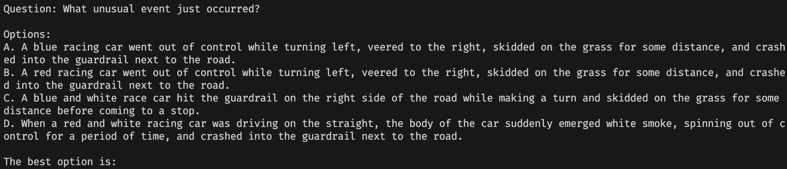

## Quantization Compression and Model Deployment

### 1. Audio Streaming Input

Most existing models can only start audio encoding after the entire audio input signal is complete. Large language models must wait for the complete encoding of visual/audio input before processing, resulting in significant latency. To address this, we have modified the audio encoder to support online streaming processing, achieving lower latency. We split the input audio into multiple segments, each representing one second of audio as a fixed number of audio tokens. During audio encoding, each segment uses causal attention, focusing only on itself and previous segments, thus meeting the requirements for online streaming encoding while maintaining minimal information loss compared to offline encoding.

### 2. Model Quantization Compression

Quantization compression is a common optimization for edge deployment. It reduces model size, increases inference speed, lowers power consumption, and decreases bandwidth requirements, improving the performance and efficiency of edge devices and ensuring deep learning models run efficiently on resource-limited hardware. We quantized the MiniCPM-o model to 4 bits and evaluated the quantized model on a dataset to measure the loss caused by quantization. We also tested the official open-source PyTorch model on the same dataset for comparison.

#### 2.1 Quantization Evaluation

According to the application scenario of the algorithm model and the official MiniCPM-o documentation [OpenBMB/MiniCPM-o](https://github.com/OpenBMB/MiniCPM-o), we used the StreamingBench dataset [THUNLP-MT/StreamingBench](https://github.com/THUNLP-MT/StreamingBench) to evaluate the performance of the quantized and deployed model in live streaming mode. The evaluation data contains 1500 samples, each less than 1 minute long, covering 6 task types with 250 samples per type.

The dataset format is omni-source understanding (Offline + Text Instruction), with text instructions in QA pair format. Video segments are clipped according to timestamps and the correct answer is inferred. Example QA pair:

Comparison of quantized deployed model and PyTorch model on each subtask and overall metrics:

| Model/Solution                | Misleading Context Understanding | Source Discrimination | Emotion Recognition | Anomaly Context Understanding | Scene Understanding | Multimodal Alignment | Overall Accuracy | Note (Module Precision)      |
| ---------------------------- | -------------------------------- | --------------------- | ------------------- | ----------------------------- | ------------------- | -------------------- | -------------- | ---------------------------- |
| pytorch bf16 (official)      | 32.8                             | 62.4                  | 48.4                | 38.4                          | 24.4                | 78.4                 | 47.5           | apm(fp16)+vpm(fp16)+llm(f16) |
| pytorch gptq (official quant)| 33.2                             | 54.8                  | 50.8                | 36.4                          | 31.2                | 71.6                 | 46.3           | apm(fp16)+vpm(fp16)+llm(q4)  |
| minicpmo-cpp mix-precision       | 29.2                             | 62.4                  | 44.4                | 41.2                          | 20.8                | 80.8                 | 46.5           | apm(q4)+vpm(fp16)+llm(q4)    |
| minicpmo-cpp full-q4             | 28.0                             | 61.2                  | 48.4                | 37.2                          | 19.6                | 79.2                 | 45.6           | apm(q4)+vpm(q4)+llm(q4)      |

Note:
- apm (audio processing module): Whisper-300M encoder
- vpm (visual processing module): SigLip-400M
- llm (language model): Qwen2.5-7B

#### 2.2 Device VRAM Usage

During device VRAM usage testing, the tts (text-to-speech) model was under development, so the following data does not include the tts model:

| Model/Solution                | VRAM(GiB) Inference | VRAM(GiB) Weight Init | Note (Module Precision)      |
| ---------------------------- | ------------------- | --------------------- | ---------------------------- |
| pytorch bf16 (official)      | 38.04               | 17.22                 | apm(fp16)+vpm(fp16)+llm(f16) |
| pytorch gptq (official quant)| 29.23               | 8.51                  | apm(fp16)+vpm(fp16)+llm(q4)  |
| minicpmo-cpp mix-precision       | 7.09                | 6.75                  | apm(q4)+vpm(fp16)+llm(q4)    |
| minicpmo-cpp full-q4             | 6.63                | 6.29                  | apm(q4)+vpm(q4)+llm(q4)      |

Note:
- For minicpmo-cpp deployment, context size is set to 8192 tokens. The larger this parameter, the more VRAM is consumed, mainly for kvcache space. At this setting, the kvcache buffer is 448MiB.

### 3. Inference Performance Optimization

After quantization compression, the model can run offline on devices with 8GB VRAM. The target scenario is video stream processing, so to enhance user experience, we optimized inference performance based on the characteristics of Jetson Orin Nano 8GB. The final result achieves real-time processing and low first-token latency.

#### 3.1 Inference Speed

NVIDIA Jetson series devices use a unified memory architecture, where RAM and VRAM share the same physical memory chip. The shared nature of total memory/bandwidth can cause potential contention. To maximize inference performance, we keep compute-intensive parts resident in device memory, avoiding swapping program memory pages to disk swap partitions/files, which would degrade inference performance. During inference, we set the model context length to 4096 (can process 30 seconds of video, peak memory usage about 7GiB), and disable the graphical interface (freeing about 200MiB memory).

After optimization, in Jetson Orin Nano Super mode, real-time video stream processing is achieved. Inference time for each module:
| Module Name                         | Inference Time (ms) |
| ----------------------------------- | ------------------- |
| Visual Encoding Module              | 887.106             |
| Audio Encoding Module               | 45.292              |
| Multimodal Prefill                  | 40.594              |
| Visual+Audio+Modal Prefill+Preproc  | 990.316             |

#### 3.2 First Token Latency

With support for streaming input in the audio encoding module and inference speed optimization, we achieved real-time video stream processing and extremely low first-token latency.
| Name            | Time             |
| --------------- | ---------------- |
| First Token Latency | 464 ms       |
| Decode Speed    | 10.39 tokens/s   |

## 3. Summary

We quantized the model to 4 bits, greatly reducing device VRAM usage while minimizing quantization loss. Compared to the official bfloat16 precision PyTorch model:
- On the StreamingBench dataset for live streaming tasks, the benchmark accuracy dropped by 2 points (for every 100 questions, there are 2 more incorrect answers)
- With a context of 8192 tokens (can process up to 60 seconds of video), peak inference VRAM usage dropped from 38.04GB to about 7GB
